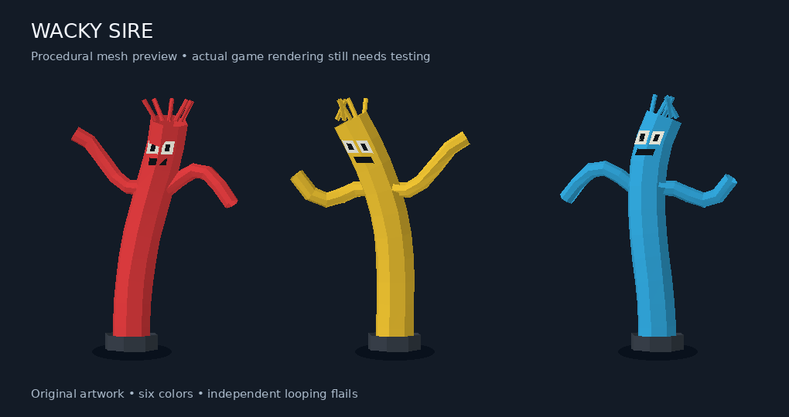

# Wacky Sire

A RuneLite Plugin Hub **A Runelite Plugin** that replaces Abyssal Sire's
tentacle visuals with colorful wacky waving inflatable flailing arm tube men.

## Features

- Original low-poly 3D mesh: hollow tube, two flailing arms, face, fabric streamers, blower base.
- Six colors selected deterministically by the tentacle's location.
- Independent looping animation, unrelated to attacks or the tentacle's state.
- Exactly five Sire tentacle variants (5909–5913); respiratory systems, Sire,
  spawns and other bosses are excluded.
- Optional original tentacle visuals alongside the tube men.
- Cleanup on disable, despawn, loading, logout and hopping.
- Original visuals remain if assets are unavailable or model construction fails.
- No bundled custom cache, network requests, runtime reflection or extra runtime dependencies.

## What this changes

This draws separate client-side `RuneLiteObject`s and uses the public
`RenderCallbackManager` to suppress the matched NPCs' scene geometry.
It does not write NPC definitions, animations, combat state, collision, tiles,
menus or server data. The original NPC UI draw pass is allowed.

**Suppressing an entity also removes its original client clickbox.** Replacement
mode consequently changes local hover/examine targeting and may allow clicking
through to an entity behind it. Tube men are decorative scene objects with no
NPC menus. This is not a transparent swap that preserves original hitboxes.
The original tentacle attack/sleep/stun animations are also replaced with a
constant flail. Enabling **Keep original tentacles visible** preserves the
original geometry and client clickboxes, with tube men drawn alongside.

The project has been visually tested in the live game. It is working on Vanilla, HD117, and GPU plugin.

## Run locally

1. Extract this project. Install [IntelliJ IDEA](https://www.jetbrains.com/idea/)
   and an [Eclipse Temurin Java 11 JDK](https://adoptium.net/temurin/releases/?version=11).
2. In IntelliJ choose **Open**, select this folder and import the Gradle project.
   Set the project and Gradle JVM to Java 11.
3. In the Gradle panel run **Tasks → verification → test**, then the **run** task.
   In a terminal, use `./gradlew test` followed by `./gradlew run`.
   Windows PowerShell: `./gradlew.bat test` then `./gradlew.bat run`.
4. In the development client, enable **Wacky Sire** and visit a Sire chamber.
   The plugin also handles being enabled while the chamber is already loaded.

Jagex account users should follow RuneLite's official
[development-client login guide](https://github.com/runelite/runelite/wiki/Using-Jagex-Accounts)
if the development client cannot log in normally.

The project defaults to `latest.release`, as recommended by the Plugin Hub.
For the version initially compiled against, use
`./gradlew test -PruneLiteVersion=1.13.1`.

## Code map

| File | Role |
| --- | --- |
| `WackySirePlugin.java` | Tracks NPCs, registers cosmetic objects, cleans up and filters rendering |
| `TentacleIds.java` | Restricts the effect to five named Sire tentacle IDs |
| `TubeMesh.java` | Generates original tube-man geometry and looping poses |
| `TubeModelFactory.java` | Builds native models without changing cache arrays |
| `WackySireConfig.java` | Optional original-visuals setting |
| `WackySireLauncher.java` | Launches a RuneLite development client |
| `MeshPreview.java` | Exports the real mesh for an offline artwork preview |

The procedural mesh uses cache model 823 only as a single-triangle allocation
primitive, then merges isolated clones and overwrites their vertex coordinates
and face colors. Runtime checks reject an unexpected primitive or merged shape.
Each tentacle owns its native model arrays. The 64 immutable geometry poses are
shared to avoid per-tick mesh allocation. Initial lighting is retained during
the deformation; moving highlights are not relit every frame.

## References

- [Official Plugin Hub submission guide](https://github.com/runelite/plugin-hub)
- [RuneLiteObject API](https://static.runelite.net/runelite-api/apidocs/net/runelite/api/RuneLiteObject.html)
- [RenderCallback API and clickbox behavior](https://static.runelite.net/runelite-client/apidocs/net/runelite/client/callback/RenderCallback.html)
- [RuneLite example plugin](https://github.com/runelite/example-plugin)

The mesh and animation are original procedural artwork. OSRS cache primitives
remain supplied by the game, not redistributed in this repository.
